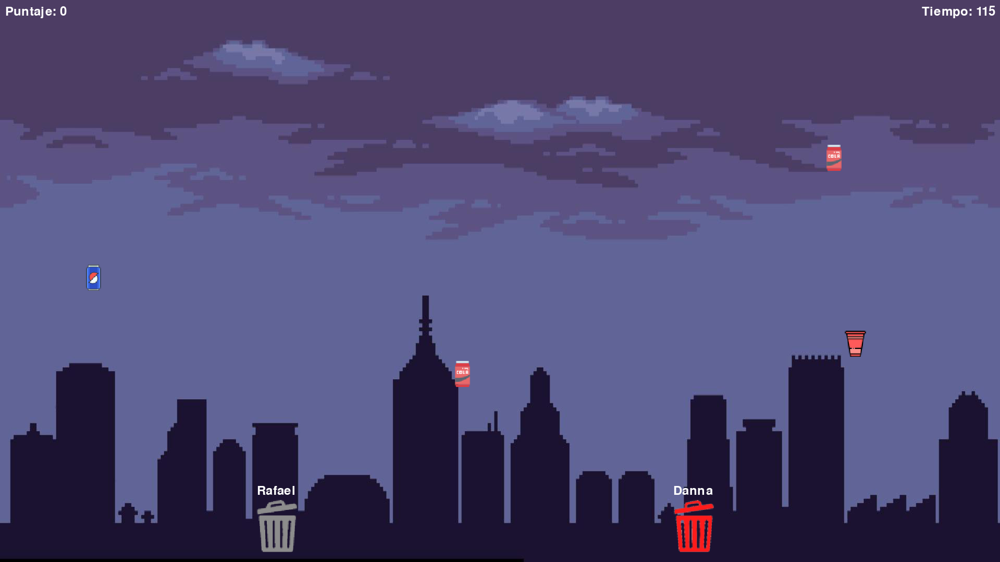

# CatchingTrash

## Descripción

`CatchingTrash` es un juego arcade de ritmo rápido para dos jugadores donde el objetivo es recoger la mayor cantidad de basura posible antes de que se acabe el tiempo. Cada jugador controla un bote especializado en un tipo de residuo (aluminio o plástico) y debe recoger únicamente la basura que le corresponde para sumar puntos. ¡Ten cuidado de no recoger el tipo incorrecto o perderás puntos!

## Características Principales

*   **Modo Multijugador Local:** Compite contra un amigo en la misma pantalla.
*   **Dos Tipos de Basura y Botes:** Un jugador se encarga del aluminio y el otro del plástico.
*   **Sistema de Puntuación Dinámico:** Gana puntos por recoger la basura correcta, pierde puntos por la incorrecta.
*   **Tiempo Límite:** El juego dura 2 minutos (120 segundos).
*   **Pantallas Interactivas:** Menús de inicio, instrucciones detalladas, pantalla de pausa y resultados finales.
*   **Música de Fondo:** Para una experiencia de juego más amena.
*   **Soporte para Pantalla Completa:** Juega en la resolución que prefieras (alterna con F11).
*   **Textos Flotantes:** Indicadores visuales para los puntos ganados o perdidos.

## Detalles Técnicos

*   **Lenguaje de Programación:** Python 3
*   **Biblioteca Principal:** Pygame
*   **Manejo de Recursos:** Las imágenes y otros assets se gestionan mediante una función `resource_path` para asegurar la compatibilidad tanto en ejecución directa desde el código fuente como en la versión compilada (ej. con PyInstaller).

## Estructura del Repositorio

*   `main.py`: Contiene toda la lógica del juego.
*   `assets/`: Carpeta con todas las imágenes y la música utilizada en el juego.
*   `dist/`: (Si existe) Contiene la versión ejecutable del juego lista para distribuir después de compilar con PyInstaller.
*   `build/`: (Si existe) Carpeta generada por PyInstaller durante el proceso de compilación.
*   `CatchingTrash.spec`: Archivo de configuración para PyInstaller.
*   `README.md`: Este archivo.
*   `LICENSE`: Archivo con la licencia del proyecto.

## Instalación y Uso

Existen dos maneras de jugar `CatchingTrash`:

### 1. Ejecutar desde el Código Fuente

**Requisitos Previos:**

*   Python 3 (se recomienda la última versión estable). Puedes descargarlo desde [python.org](https://www.python.org/downloads/).
*   Pygame.

**Pasos:**

1.  **Clona o descarga este repositorio:**
    ```bash
    git clone https://github.com/tu_usuario/CatchingTrash.git
    cd CatchingTrash
    ```
    (Reemplaza `tu_usuario` con tu nombre de usuario de GitHub si ya lo has subido, o simplemente navega a la carpeta del proyecto si lo descargaste como ZIP).

2.  **Crea un entorno virtual (recomendado):**
    ```bash
    python -m venv .venv
    # En Windows
    .venv\Scripts\activate
    # En macOS/Linux
    source .venv/bin/activate
    ```

3.  **Instala las dependencias (Pygame):**
    ```bash
    pip install pygame
    ```

4.  **Ejecuta el juego:**
    ```bash
    python main.py
    ```

### 2. Ejecutar la Versión Compilada (si está disponible)

Si se proporciona una versión compilada del juego (generalmente un archivo `.exe` para Windows o un ejecutable para otros sistemas operativos), esta se encontrará en la carpeta `dist/`.

1.  Ve a la sección de "Releases" (Lanzamientos) del repositorio de GitHub (si existe) o busca la carpeta `dist/` en los archivos del proyecto.
2.  Descarga el archivo ejecutable o el paquete comprimido.
3.  Si es un archivo comprimido, extráelo.
4.  Ejecuta el archivo principal del juego (por ejemplo, `CatchingTrash.exe`).

## Controles del Juego

El juego está diseñado para dos jugadores:

*   **Jugador 1 (Bote de Aluminio):**
    *   Mover a la Izquierda: **Flecha Izquierda**
    *   Mover a la Derecha: **Flecha Derecha**
*   **Jugador 2 (Bote de Plástico):**
    *   Mover a la Izquierda: **Tecla A**
    *   Mover a la Derecha: **Tecla D**

**Otros Controles:**

*   **F11:** Alternar modo pantalla completa / ventana.
*   **Barra Espaciadora / Enter:** Avanzar en las pantallas de menú (instrucciones, inicio, etc.).
*   **Escape (ESC):** Pausar el juego / Abrir menú de pausa.

## Cómo Contribuir

Las contribuciones son bienvenidas. Si deseas contribuir:

1.  Haz un "Fork" del repositorio.
2.  Crea una nueva rama para tu característica o corrección (`git checkout -b feature/nueva-caracteristica` o `git checkout -b bugfix/descripcion-del-bug`).
3.  Realiza tus cambios y haz "commit" (`git commit -m 'Añade nueva característica X'`).
4.  Haz "Push" a tu rama (`git push origin feature/nueva-caracteristica`).
5.  Abre un "Pull Request".

Por favor, asegúrate de que tu código siga las convenciones de estilo del proyecto y de que esté bien comentado donde sea necesario.

## Ilustraciones




## Licencia

Este proyecto está bajo la Licencia MIT. Consulta el archivo `LICENSE` para más detalles.

---

Desarrollado como parte de un proyecto de Herramientas de Software.